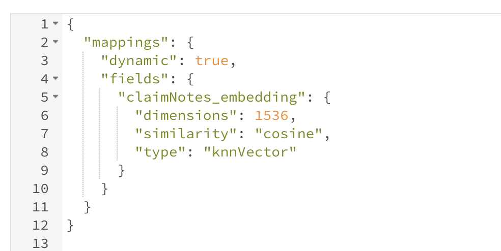
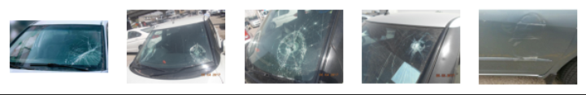

# Insurance-image-search

The python notebook included in this repository contains a basic script that lets the user perform similarity search using [Atlas Vector Search](https://www.mongodb.com/products/platform/atlas-vector-search).
The steps outlined in the code are the following:

1. Define an image embedder based on the pytorch version of squeezenet
2. Download and save to file the public "car damage" dataset. The dataset contains images of car damages
3. Connect to MongoDB Atlas
4. Create the Search index (see our index in the below image)

{
   width:150px;
   height:100px;
}

6. Get image embeddings and load them to Atlas
7. Run an image similarity query

Here's an example of a query of an image found online

And its output

